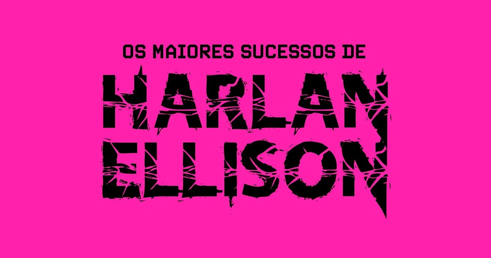

title=Ficção Especulativa de Peso: Harlan Ellison Ganha Edição Inédita no Brasil pela Editora Diário Macabro
date=2026-09-13
type=post
tags=harlanellison, ficcaocientifica, literatura, financiamentocoletivo
status=published
description=A Editora Diário Macabro acaba de lançar um financiamento coletivo inédito que busca trazer grandes obras do importante autor de ficção Harlan Ellison para o Brasil, o obra irá conter 19 obras traduzidas e já se posiciona contra o uso de Inteligência Artificial.
image=/rpgzine/blog/2026/os-maiores-sucessos-harlen.webp
~~~~~~

Se você curte ficção científica, distopias marcantes e literatura antissistema, certamente já cruzou com a influência de **Harlan Ellison**, mesmo sem perceber. Considerado um dos autores mais prolíficos, combativos e premiados do século XX, Ellison conquistou prêmios consagrados como **Hugo, Nebula, Locus, Bram Stoker e Edgar Allan Poe**. Sua produção influenciou diretamente a ficção especulativa e serviu de base para ideias que inspiraram obras como **O Exterminador do Futuro** e **V de Vingança**, além de ter mentorado autores como **Octavia E. Butler** e **Dan Simmons**. Apesar de todo esse legado  — e de nomes como **George R. R. Martin** o apontarem como um dos maiores escritores da literatura —, a obra do autor permaneceu em grande parte inédita no Brasil. Por aqui, apenas alguns quadrinhos roteirizados por Ellison foram publicados, além de um quadrinho que adaptou o famoso episódio de Star Trek, sem as edições de Gene Roddenberry no roteiro.

Para mudar esse cenário, a **Editora Diário Macabro** lançou no Catarse a campanha de financiamento coletivo para publicar **[Os Maiores Sucessos de Harlan Ellison](https://catarse.com.br/harlan)**, tradução integral da renomada coletânea *Greatest Hits*.

*[Clique aqui para acessar o financiamento coletivo no Catarse](https://catarse.com.br/harlan)*

### **Uma Seleção de 19 Obras Organizada por J. Michael Straczynski**

Organizada pelo escritor e criador **J. Michael Straczynski** (*Babylon 5*, *Sense8*), a coletânea reúne 19 contos e novelas fundamentais que servem como introdução perfeita e panorama da evolução literária do autor. Entre os destaques está a clássica narrativa “**Arrependa-se, Harlequin! Disse o Homem Tique-Taque**”, história vencedora do prêmio Hugo apontada por Alan Moore como o gérmen para a HQ *V de Vingança*[7]. Outro marco presente no volume é “**Não tenho boca e preciso gritar**”, conto sobre uma inteligência artificial totalitária que destruiu a humanidade e mantém apenas cinco sobreviventes sob tortura física e psicológica — narrativa que serviu de inspiração para a animação *O Incrível Circo Digital*.

A edição brasileira organiza as obras em **cinco núcleos temáticos**:

* **Deuses Furiosos**: focado em revoltas contra autoritarismo e sistemas de controle.
* **Almas Perdidas**: focado em personagens deslocados, identidades fragmentadas e solidão.
* **A Passagem do Tempo**: abordando a mortalidade, a memória e a experiência da perda.
* **O Lado Mais Leve**: apresentando o humor excêntrico, irreverente e ácido de Ellison.
* **A Palavra Final**: encerrado pela extensa e pessoal novela autobiográfica “Minha vida e todas as suas mentiras”.

### **Tradução Integral, Projeto Gráfico Nacional e Postura Contra IA**

O trabalho de tradução foi realizado por **L. F. Lunardello**, tradutor e editor com mais de vinte anos de experiência em literatura insólita, de forma integral e sem omissões, condensações ou suavizações do texto original. Em relação ao formato físico, a editora adaptou o projeto norte-americano para um formato nacional ampliado de **16x23 cm**, com aproximadamente 368 páginas em papel amarelado e acabamento em brochura com orelhas. A ilustração de capa foi criada pelo artista **Preto Pasin**, enquanto a edição e coordenação geral do projeto são lideradas por **Nathalia Sorgon Scotuzzi** e o projeto gráfico por **Pedro H. S. Andrade**.

Em consonância com a verve crítica do próprio Ellison, a editora adotou uma **postura 100% contrária ao uso de Inteligência Artificial**, garantindo que todas as etapas de produção do livro — tradução, revisão, edição e ilustrações — fossem realizadas exclusivamente por profissionais humanos.

### **Recompensas e Como Garantir o Seu Exemplar no Catarse**

A campanha de arrecadação já está no ar na plataforma **[Catarse](https://catarse.com.br/harlan)**, oferecendo recompensas que variam entre marcadores de páginas especiais, blocos de anotações e kits de bottons políticos com frases do autor, até pôsteres e combos com outros livros do catálogo da editora. Durante o financiamento coletivo, o livro pode ser garantido pelo valor promocional de **R$ 75,00**, valor inferior ao praticado no mercado internacional e que não será mantido após o envio do título para as livrarias.

Para quem aprecia ficção científica transgressora, RPGs com cenários distópicos ou quer conhecer a origem da ficção especulativa moderna, apoiar o lançamento de **Harlan Ellison** é uma oportunidade de valorizar esse mercado editorial independente no Brasil.

---

[Site da Editora Diário Macabro](https://diariomacabro.com.br/)
[Harlan Ellison na Wikipedia](https://pt.wikipedia.org/wiki/Harlan_Ellison)
[A antologia perdida de Harlan Ellison na Momentum Saga](https://www.momentumsaga.com/2021/05/a-antologia-perdida-de-harlan-ellison.html)
[Arigo sobre a obra no site RPG News](https://newsrpg.wordpress.com/2026/09/13/financiamento-coletivo-os-maiores-sucesso-de-harlan-ellison/)
[Live sobre o financiamento coletivo da Ed. Diário Macabro no canal Formiga Elétrica](https://www.youtube.com/watch?v=p3nwSBJnHnI)
[Os maiores sucessos de Harlan Ellison no canal da Editora Diário Macabro](https://www.youtube.com/watch?v=lS7yoJNJs8k)
