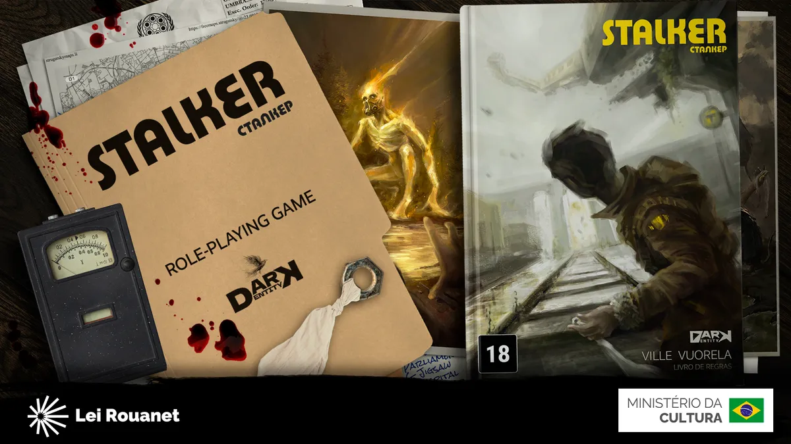

title=2ª Edição do Stalker RPG em Financiamento Coletivo
date=2026-09-14
type=post
tags=rpg, stalker
status=published
description=A Editora Dark Entity lançou um financiamento coletivo para a produção da segunda edição do RPG Stalker em Português. A nova edição promete seguir fiel ao sistema flow que reduz a necessidade de rolar dados e acrescentar novidades como um cenário ambientado no Brasil.
image=/rpgzine/blog/2026/stalker-rpg-2-edicao.webp
~~~~~~

O episódio recente do podcast *A Forja* produzido pelo [RPG Next](https://www.youtube.com/watch?v=5rMcXU0W9iw) trouxe uma entrevista muito interessante com Thiago Moura e Fausto Maiandi, fundadores da **[Dark Entity](https://www.darkentitygroup.com/)**. O objetivo foi apresentar a segunda edição de um clássico da ficção científica e do horror nos RPGs: **Stalker**.

[*STALKER*](https://www.darkentitygroup.com/pt/stalker) é um jogo RPG de mesa de ficção científica criado pelo finlandês Ville Vuorela em 2008. O sistema é baseado no livro "[Piquenique na Estrada](https://link.amazon/B02gMZLQt)" de Arkady e Boris Strugatsky e no filme homônimo de Andrei Tarkovsky. A primeira versão do sistema foi traduzida e lançada em português em 2027 pela Editora Dark Entity.

Se você perdeu a transmissão, preparamos um resumo completo destacando os pontos principais abordados no bate-papo.

## 1. Conheça a Editora Dark Entity

A **Dark Entity** nasceu da sinergia entre amigos brasileiros que viviam na Europa (Irlanda e Reino Unido) e compartilhavam o hábito de criar e adaptar regras de RPG para enriquecer suas mesas. O projeto inicial da editora começou com o desenvolvimento de um cenário autoral monumental chamado *Forsaken Paradise*. Para estruturar o negócio e viabilizar os custos de uma editora, o trio decidiu buscar licenciamentos internacionais. O primeiro grande passo dessa empreitada é a publicação oficial do **Stalker RPG** no Brasil. A publicação abriu as portas tanto para trazer tesouros internacionais inéditos em português quanto para, futuramente, exportar criações autorais brasileiras para o mundo.

## 2. O RPG Stalker e sua Ambientação

Por ser baseado no aclamado livro russo *Piquenique na Estrada* (dos irmãos Strugatsky) e na atmosfera melancólica do cinema de Tarkovsky, **Stalker** é um RPG de **horror, sobrevivência e ficção científica filosófica**.

O universo do jogo se passa em um mundo semelhante ao nosso, mas que sofreu o evento da "Visitação": alienígenas visitaram a Terra e, em vez de destruírem o planeta ou travarem guerras épicas, simplesmente deixaram para trás o seu "lixo espacial" e foram embora. Isso gerou as chamadas "Zonas" — perímetros fechados espalhados pelo globo onde as leis da física não funcionam e existem artefatos e criaturas bizarras. Os jogadores assumem o papel de **Stalkers**: marginais e mercenários que entram clandestinamente nessas zonas hostis em busca de sobrevivência e artefatos inexplicáveis, lidando constantemente com escolhas morais difíceis e consequências implacáveis.

## 3. O Sistema Flow: Interpretação, Improviso e Narrativa

O grande diferencial mecânico de *Stalker* é o **Sistema Flow**. Esse sistema foi desenvolvido para valorizar profundamente a interpretação, o improviso e a participação ativa dos jogadores na construção da narrativa.

* **Sem dados por padrão:** Na sua versão purista, o sistema não utiliza rolagens de dados. Para superar um obstáculo, o mestre avalia dois pilares fundamentais de 1 a 5: a **interpretação** do jogador (agir de acordo com o arquétipo do personagem) e a **qualidade da ideia/engenhosidade** aplicada para resolver o problema.
* **Multiplicação de notas:** A nota da ideia é multiplicada pela nota da interpretação, somando-se bônus caso o personagem possua uma habilidade técnica pertinente (como engenharia, medicina, etc.). O resultado final dita se o personagem ultrapassa ou não a dificuldade imposta pelo mestre.
* **A Mão do Destino:** Como o jogo é extremamente letal, os jogadores podem optar por "queimar" pontos de seus atributos de ficha para dobrar a realidade e escapar de situações de morte iminente, sofrendo sequelas narrativas severas em troca da sobrevivência.

## 4. Novidades da Segunda Edição

A segunda edição chega ao Brasil pela Dark Entity trazendo melhorias estruturais e novidades fundamentais para atrair diferentes perfis de jogadores:

* **Cenário Nacional:** Conteúdo inédito focado em uma **Zona localizada em São Paulo**, adaptando a atmosfera de *Stalker* para a realidade brasileira.
* **Variante com Dados:** Pensando nos jogadores que sentem falta da emoção e do fator aleatório dos dados, a Dark Entity implementou em total acordo com o autor original uma **regra opcional baseada em reservas de D6**. Nela, o mestre ainda avalia a ideia e a interpretação, mas em vez de multiplicar notas, concede dados extras (ou penalidades por dificuldade) para testar a sorte tirando resultados 5 ou 6, mantendo a essência criativa do Flow aliada ao velho frio na barriga do dado rolando.

## 5. Diferenças para Outros Sistemas e o Foco Old School

Enquanto sistemas tradicionais focados em combate tático (como *Dungeons & Dragons*) priorizam a rolagem de dados em detrimento da descrição, a ficha recheada de pontos de vida e a resolução mecânica isolada das interpretações, *Stalker* caminha na contramão.

O sistema evoca características fortes dos clássicos **Dungeon Crawlers Old School** e movimentos modernos como *Dungeon Crawl Classics*:

* **A Morte é Real:** Tentar peitar um perigo ou monstro na força bruta ou correndo para cima com uma arma geralmente resulta em morte rápida.
* **Sagacidade acima de Ficha:** O sucesso do jogador depende estritamente de como ele usa o ambiente, testa armadilhas com cautela (como jogar uma porca no chão ou calcular os riscos) e improvisa soluções engenhosas.
* **Foco na História:** Não existem pontos de vida tradicionais (HP); os ferimentos e os combates são tratados de forma totalmente narrativa, onde o objetivo principal é a sobrevivência, a imersão e o desenvolvimento da trama e das escolhas morais dos personagens.

---

### Quer apoiar o projeto?

A pré-campanha de financiamento coletivo para trazer os materiais traduzidos e impressos de *Stalker 2ª Edição* já está movimentando a comunidade! Para acompanhar de perto as novidades da editora e garantir o seu exemplar, acesse os links oficiais da **Dark Entity**:

* **Instagram:** [@darkeditora](https://www.google.com/search?q=https://www.instagram.com/darkeditora)
* **Site Oficial:** [darkentitygroup.com/pt/stalker](https://www.darkentitygroup.com)
* **Campanha no Catarse:** [catarse.br/stalker-rpg](https://catarse.com.br/stalkerrpg)  
